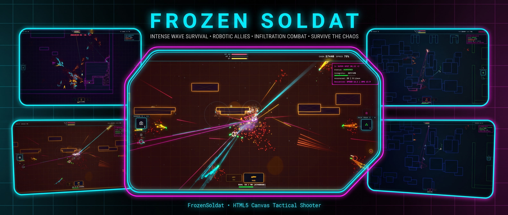

  
  
  ### [> DEPLOY NOW (Play in Browser) <](https://skatardude10.github.io/FrozenSoldat/LATEST_MASTER.html)

  <strong>A hardcore, tactical top-down shooter and extraction simulator.</strong>   
  Runs instantly in your browser. No downloads, no game engines, zero assets. 
  
  Just deep weapon physics, unforgiving AI, and perimeter defense.

## The Rundown
Frozen Soldat strips away the fluff. You are dropped into a hostile, procedurally generated operational zone. The focus here is entirely on **game feel and tactics**. 

Weapons have physical kickback that affects your movement. Sustained fire causes thermal spread and laser divergence. Bullets penetrate walls or ricochet based on caliber and angle. Enemies don't just swarm you—they flank, suppress, communicate, and react to your noise. 

Survive, earn Intel, upgrade your kit, and extract.

 

## Core Features

*   **Extraction Ops (The Flagship Mode):** Infiltrate massive 7500x7500 maps. Crack uplinks, rescue captive assets, and manage the dynamic **Heat Director**—where every gunshot, wall breach, and explosion draws more enemy squads to your position. Get to the evac zone before you are overrun.
*   **FPV Operator Mode:** A completely asymmetric survival experience. You are locked in a bunker. Your only offense? Piloting FPV bomber drones, deploying automated turrets, and dispatching SPOT robot dogs while monitoring a security feed.
*   **Deep Weapon Physics:** Open-bolt firing delays, dynamic laser sight collimation, stamina-draining equipment weight, and recoil that physically shoves your character.
*   **Destructible Environments:** Blow open walls with C4, or grind through enemy bunkers cell-by-cell with your breaching drill to create new tactical flanking routes. 
*   **Armory & Meta-Progression:** Extract with Intel to permanently upgrade your operative. Unlock underbarrel grenade launchers, extended mags, prism-array laser sights, and Operator Kits (*Breacher, Ghost, Technician*). 
*   **Dynamic Boss Fights:** Face down 5 distinct bosses, including cloaked Infiltrators, 4-man Hammerhead APCs, and Widowmaker sniper walkers.
*   **Couch Co-Op & PvP:** Plug in two controllers for seamless 2-player local co-op. Turn on hardcore friendly fire, or switch to PvP mode and hunt each other down.

## The Tech (Under the Hood)
Frozen Soldat is built entirely in **Vanilla JavaScript and HTML5 Canvas**. 

**There are zero external assets.** 
*   **No image files:** Every sprite, shadow, particle, and UI element is drawn via Canvas API.
*   **No sound files:** Every gunshot, sonic boom, ricochet, robotic hum, and explosion is synthesized procedurally in real-time using the **Web Audio API**. 
*   **Single File:** The entire game—engine, rendering, spatial-partitioning AI, A* pathfinding, and UI—lives in a single monolithic `.html` file.

## Controls
The engine automatically detects and hot-swaps between inputs without pausing.
*   **Keyboard & Mouse:** Classic WASD movement and mouse aim. (Scroll wheel swaps weapons, `Q`/`Z` cycles gear, `E`/`C` uses it, Hold `F` to drill/interact).
*   **Controller:** Full twin-stick shooter support with aim-assist deadzones and rumble/kickback.
*   **Mobile / Touch:** Dynamic floating joysticks and context-aware screen tapping for placing waypoints and grabbing loot.

## Classified: Developer Terminal
If you want to break the game, test heavy artillery early, or turn on god mode: 
1. Rapidly click the "FROZEN SOLDAT" title text on the main menu **10 times**. 
2. Once the notification pops up, press `~` or `F1` during a match to open the Developer Command Center.
3. Spawn bosses, force wave mutators (like *Blackout* or *Swarm Season*), and toggle experimental perks.
