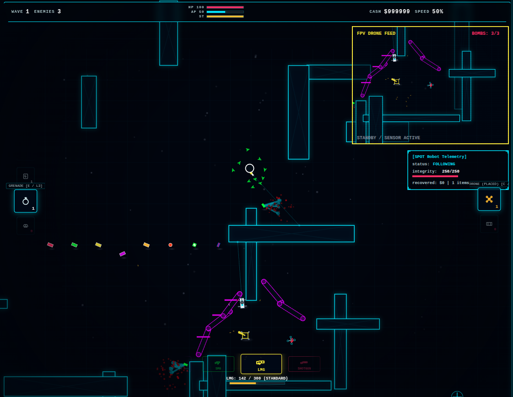

# Frozen Soldat

A tactical, top-down weapon physics simulator and wave survival game. Runs instantly in your browser. No downloads, no heavy engines, just heavy guns and perimeter defense.

### [> PLAY IT NOW IN YOUR BROWSER <](https://skatardude10.github.io/FrozenSoldat/LATEST_MASTER.html)

## The Rundown
Frozen Soldat strips away the fluff. You are dropped into a dark, modular arena. Waves of enemies push your position. You survive, you earn cash, and you hit the armory. 

The focus here is entirely on game feel and tactics. Weapons have physical kickback that affects your movement. Bullets penetrate walls depending on caliber. When things get out of hand, you rely on deployed hardware—auto-turrets, barricades, hunter drone swarms, and robot dogs—to hold the line.

## What to Expect
* **The Combat Loop:** Survive a wave, open the mid-round shop. Manage your ammo economy, buy gear, patch your armor, or invest in weapon overclocks (like hollow-point rounds or extended mags).
* **Tactical Hardware:** Don't just shoot. Deploy a Spot robot to watch your flank, launch an FPV drone to manually fly over a crowd and drop bombs, or scatter trip mines in choke points.
* **Local Co-op:** Plug in two controllers and run 2-player local couch co-op. Friendly fire is optional, but recommended if you want chaos.
* **Meta-Progression:** Earning kills against Elites gets you Intel. Spend Intel on the main menu Armory tab to permanently upgrade your operative's base stats for future runs.
* **Procedural Audio:** The guns don't use basic sound files. Every gunshot, ricochet, and explosion is synthesized procedurally through the Web Audio API for dynamic acoustics. 

## Controls
Play how you want. The game automatically detects and hot-swaps between inputs without pausing.
* **Keyboard & Mouse:** Classic WASD movement and mouse aim. (Scroll wheel swaps weapons, Q/Z cycles gear, E/C uses it).
* **Controller:** Full twin-stick shooter support.
* **Mobile / Touch:** Dynamic floating joysticks and context-aware screen tapping for placing waypoints and grabbing loot.

## Developer Terminal
If you want to break the game, test the heavy artillery early, or turn on god mode: rapidly click the "FROZEN SOLDAT" title text on the main menu 10 times. Once the notification pops up, press `~` or `F1` during a match to open the dev console. 

---
*Built entirely with vanilla JavaScript, HTML5 Canvas, and the Web Audio API.*
