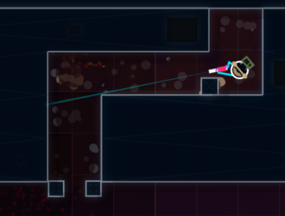
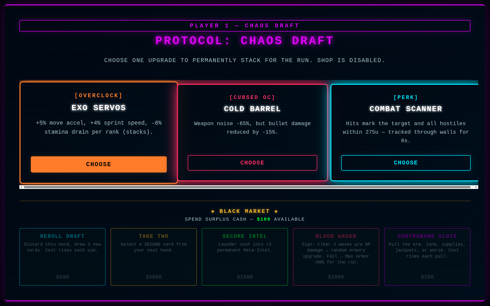
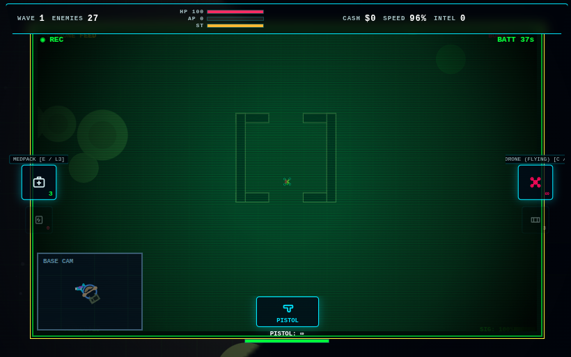
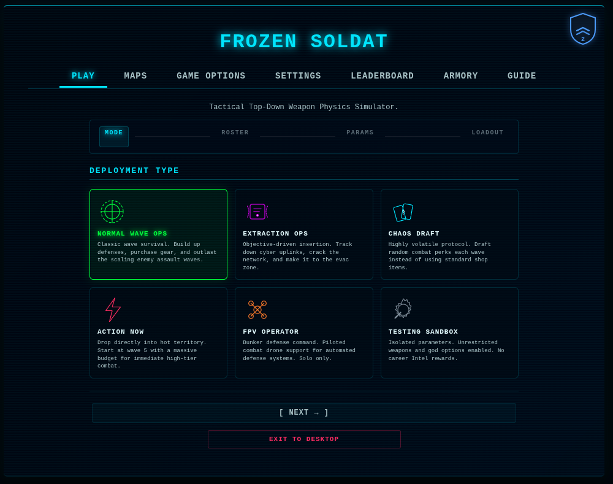

  

  **A top-down tactical shooter with an extraction mode.** 
  One HTML file. No engine, no asset files, no download — it runs in a browser tab.

Soldat and Frozen Synapse had a baby that got stuck in a browser. You drop into an operational zone and fight enemy squads that actually work together: they flank, they suppress, they share what they see, and they hear your gunshots.

**Play it:** [frozensoldatgame.com](https://frozensoldatgame.com) — keyboard, gamepad, or touch.

## Why the guns matter

Recoil physically pushes your character around. Laser sights drift as barrels heat up. Bullets punch through or ricochet depending on caliber and angle, and some fire open-bolt. All of it is simulated by hand in vanilla JS on a canvas — no engine is doing this for me.

There are seven modes; here are the ones worth knowing:

- **Normal** — waves, five bosses (a cloaked Infiltrator, a four-seat Hammerhead APC, a mortar-calling Widowmaker Walker), loot, armory upgrades
- **Extraction** — a 7500×7500 map, rescue captives, reach the uplink before the heat finds you
- **FPV Operator** — a bunker, a drone, turrets, and a robot dog with a picture-in-picture feed

Couch co-op for two on one machine (two controllers, friendly fire from off all the way to hardcore), PvP with a kill feed and a timer, a sandbox, and a peaceful mode for map builders. Waves can roll mutators — Blackout, Swarm, Juggernaut, Adrenaline.

You can also break the map. Hold F to drill cells out of a wall; the rubble goes into your bank and you can place it back anywhere. Build a fort, dig under a line of sight, or just make a mess. The armory has underbarrel grenade launchers, extended mags, prism lasers, and operator kits (Breacher, Ghost, Technician).

## Gallery

  <table>
    <tr>
      <td align="center">
         
        <em>Mine and Build</em>
      </td>
      <td align="center">
         
        <em>Fun Gambling</em>
      </td>
    </tr>
    <tr>
      <td align="center">
         
        <em>FPV Drone Operations</em>
      </td>
      <td align="center">
         
        <em>Armory and Meta-Progression</em>
      </td>
    </tr>
  </table>

## The tech, if you care

Single `index.html`, about 45k lines of vanilla JS. No image files, no audio files: sprites are drawn to the canvas, and all sound and music is synthesized live with WebAudio. Enemy AI runs A* pathfinding over spatial partitioning, and a service worker lets the page install as an app. I keep notes on the internals in `tools/` — per-system dossiers, invariants, a code map — if you want to see how it's put together.

## Controls

| Do this | Keys |
|---|---|
| Move | WASD / left stick |
| Aim + fire | mouse / right stick |
| Swap weapons | scroll wheel |
| Cycle left gear (4 slots) | Q |
| Use left / charge grenade launcher | E |
| Cycle right gear (6 slots) | Z |
| Use right / place barrier | C |
| Interact (hold to drill) | F |

Gamepads get twin-stick; touch gets dual virtual joysticks.

## Dev terminal

Click the "FROZEN SOLDAT" title 10 times on the main menu. In a match, press `~` or F1 — spawners, forced mutators, god mode, infinite cash. Everything I use for testing.
